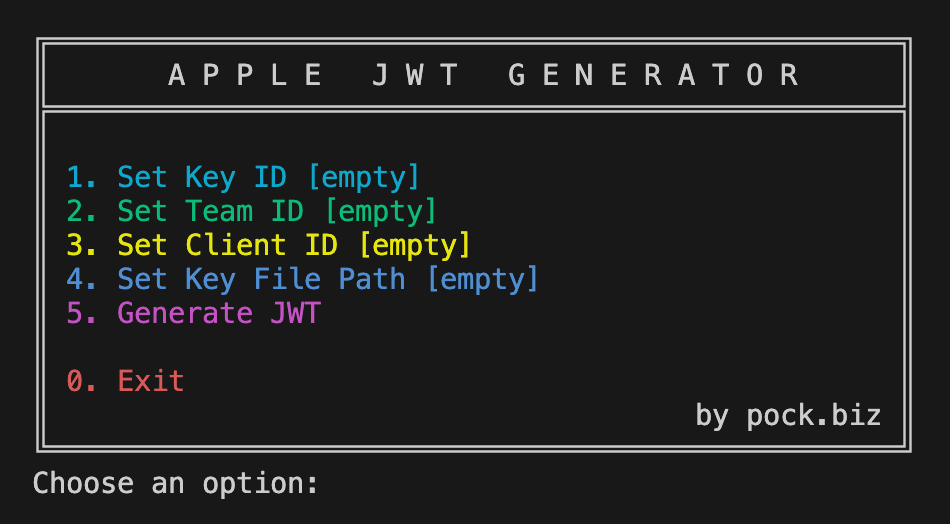

# Apple JWT Generator for Apple Sign In

Generate JSON Web Tokens (JWTs) for Apple Sign In authentication, especially useful for web platforms like Supabase.

[Download Executable Files](https://github.com/rpock/apple-jwt-generator/releases/latest)

## Quick Start

### macOS and Unix
```bash
chmod +x ./run-apple-jwt-generator.sh
./run-apple-jwt-generator.sh
```

### Windows
Double-click on `run-apple-jwt-generator.bat` or run it from the command line:
```
run-apple-jwt-generator.bat
```

## Introduction

This program generates the necessary JWT for Apple Sign In authentications implemented on web platforms like Supabase. It was inspired by the JWTToken code from [Balvinder Singh](https://gist.github.com/balvinder294) but has been updated to the latest standards and extended with a user-friendly interface.

Key improvements:
- Compatibility with Apple's .p8 file format (PEM vs. PKCS8 format)
- Interactive command-line interface for easy input
- Cross-platform support (macOS, Unix, Windows)

**Note:** As of the current Apple policies, the generated token needs to be renewed every 6 months through the web portal.

## Building from Source

### Prerequisites
- Java Development Kit (JDK) 17 or later
- Maven

### Compilation Steps
1. Clone the repository:
   ```
   git clone https://github.com/yourusername/apple-jwt-generator.git
   cd apple-jwt-generator
   ```

2. Compile and package with Maven:
   ```
   mvn clean package
   ```

3. The compiled JAR and scripts will be in the `target` directory.

## Usage

Run the program using the provided scripts or directly with Java:

```
java -jar target/applejwtgenerator-1.0-SNAPSHOT.jar
```

Follow the on-screen prompts to input:
1. Key ID
2. Team ID
3. Client ID
4. Path to the .p8 private key file

The program will then generate and display the JWT.

## Creating Executable Files

The Maven build process creates both `.sh` (for Unix/macOS) and `.bat` (for Windows) files in the `target` directory. These scripts can be used to run the program on different platforms.

To create a standalone executable JAR:

1. Ensure you have the latest version of Maven installed.
2. Run the following command in the project root:
   ```
   mvn clean package
   ```
3. Find the generated JAR file in the `target` directory.

## Example


```
$ ./run-apple-jwt-generator.sh

       A P P L E   J W T   G E N E R A T O R      

 1. Set Key ID [empty]
 2. Set Team ID [empty]
 3. Set Client ID [empty]
 4. Set Key File Path [empty]
 5. Generate JWT

 0. Exit
                                      by pock.biz 

Choose an option: 1
Enter the Key ID: Y77U7A77K7
Choose an option: 2
Enter the Team ID: D6KY777B77
Choose an option: 3
Enter the Client ID: com.your.app.signin
Choose an option: 4
Enter the Key File Path: /path/to/your/AuthKey_Y77U7A77K7.p8
Choose an option: 5
Generated JWT: eyJhbGciOiJFUzI1NiIsImtpZCI6I...

Generation time: 2024-07-28 13:04:04
Expiration time: 2025-01-27 02:34:04

Choose an option: 0

Program is terminating. Goodbye!
```

## Contributing

Contributions are welcome! Please feel free to submit a Pull Request.

## License

This project is licensed under the Apache 2.0 License - see the [LICENSE](LICENSE) file for details.

## Acknowledgments

- Balvinder Singh for the original JWTToken code inspiration.
- The open-source community for continuous support and inspiration.
